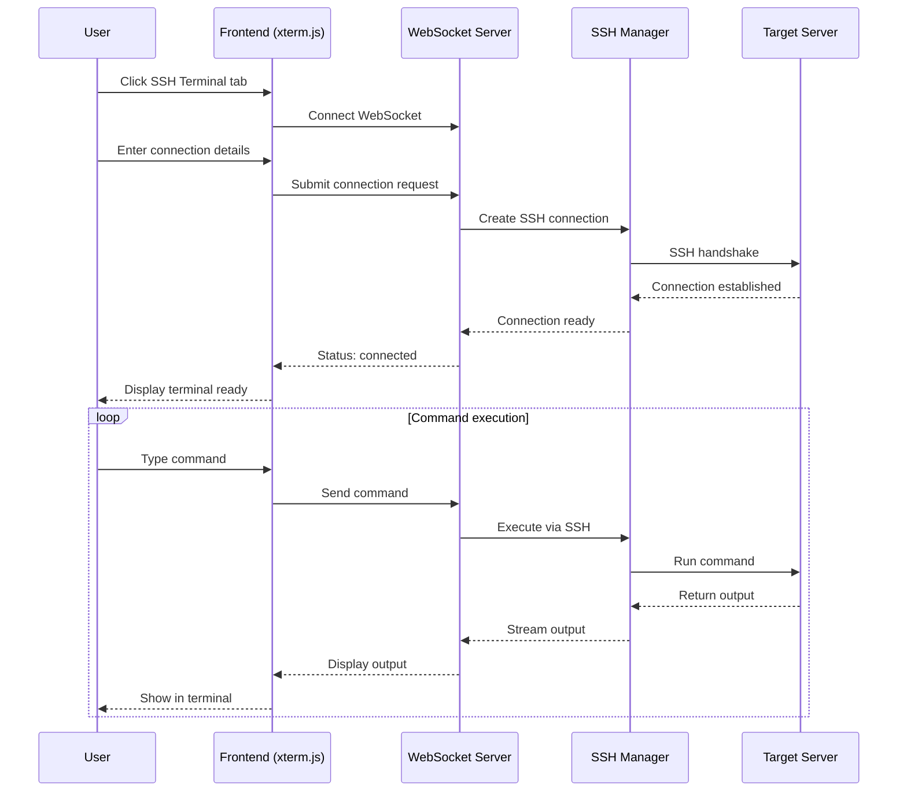

# SSH Terminal Emulator Implementation Plan

## Overview
This document outlines the implementation of a full SSH terminal emulator integrated into the configuration page of the Cacao Drying System. The terminal will provide real-time SSH access to the server hosting this service.

## Architecture Components

### 1. Frontend Components
- **Tab Interface**: Add a new "SSH Terminal" tab to the existing configuration page
- **Terminal Emulator**: Use xterm.js for terminal rendering
- **WebSocket Client**: Handle real-time communication with the backend
- **Connection Form**: UI for configuring SSH connection details
- **Command Shortcuts**: Quick access buttons for common commands

### 2. Backend Components
- **WebSocket Server**: Flask-SocketIO for real-time bidirectional communication
- **SSH Connection Manager**: Handle SSH connections using paramiko
- **Session Management**: Track active SSH sessions per user
- **Authentication Handler**: Support password and key-based authentication
- **Command Executor**: Process commands through SSH channels

### 3. Security Considerations
- Session isolation per authenticated user
- Connection timeout management
- Command logging and audit trail
- Restrict dangerous commands (optional)
- Secure credential handling

## Implementation Steps

### Phase 1: UI Development
1. Add tab navigation to configuracion.html
2. Create SSH terminal container with xterm.js
3. Design connection configuration form
4. Add connection status indicators
5. Implement command shortcut buttons

### Phase 2: Backend WebSocket Setup
1. Install Flask-SocketIO dependency
2. Create WebSocket endpoint `/ssh-terminal`
3. Implement connection event handlers
4. Add session management for SSH connections

### Phase 3: SSH Integration
1. Install paramiko for SSH functionality
2. Create SSH connection manager module
3. Implement authentication methods
4. Handle command execution and output streaming

### Phase 4: Integration & Testing
1. Connect frontend WebSocket client to backend
2. Test SSH connections with various servers
3. Implement error handling and recovery
4. Add command history persistence

## Dependencies to Add

### Python (requirements.txt)
```
Flask-SocketIO==5.3.6
python-socketio==5.8.0
paramiko==3.3.1
eventlet==0.33.3
```

### JavaScript (CDN or local)
```
xterm.js (v5.3.0)
xterm-addon-fit (v0.8.0)
socket.io-client (v4.7.2)
```

## File Structure

```
cacaodry/
├── app.py (modified)
├── requirements.txt (modified)
├── ssh_terminal/
│   ├── __init__.py
│   ├── ssh_manager.py
│   ├── socketio_events.py
│   └── utils.py
├── static/js/
│   ├── ssh_terminal.js
│   └── xterm.min.js (if serving locally)
└── templates/
    └── configuracion.html (modified)
```

## Security Implementation

1. **Authentication**: Only authenticated users can access SSH terminal
2. **Session Isolation**: Each user gets their own SSH session
3. **Timeout**: Automatic session disconnection after inactivity
4. **Logging**: All commands and outputs logged for audit
5. **Command Restrictions**: Optional blacklist of dangerous commands

## UI Mockup

The SSH terminal tab will include:
- Connection form at the top (host, port, username, password/key)
- Terminal emulator window taking most of the space
- Connection status indicator
- Common command buttons (ls, cd, pwd, top, etc.)
- Disconnect/Reconnect buttons

## Mermaid Diagram



## Next Steps

1. Review and approve this implementation plan
2. Switch to Code mode to begin implementation
3. Start with Phase 1 (UI Development)
4. Progress through each phase systematically
5. Test thoroughly before deployment